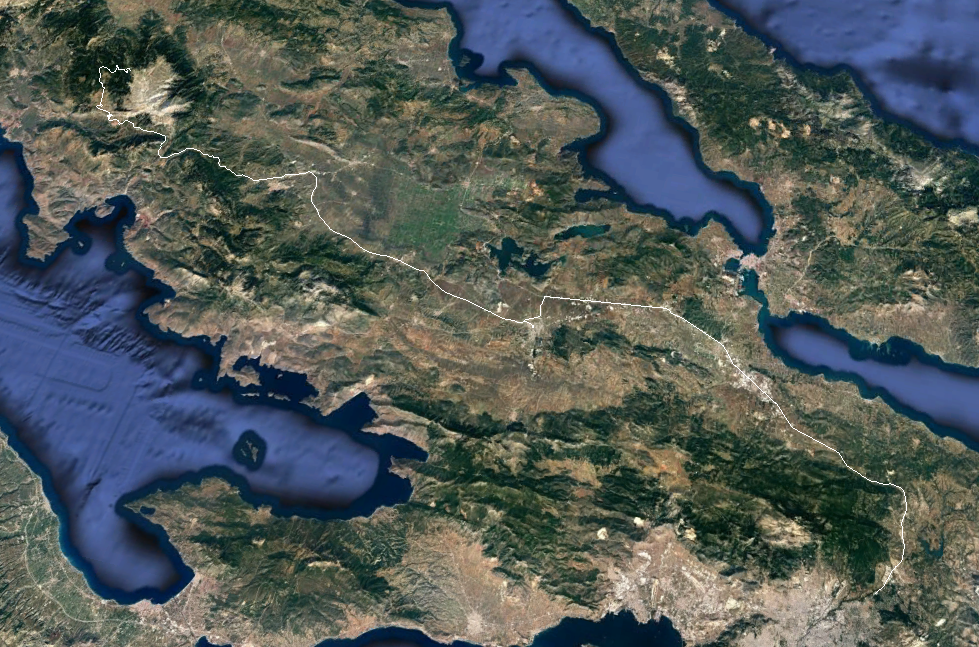

# Austeer

A simple Android app for tracking movement, speed, and steering angle for self-driving car development using neural network training, to supplement dashcam or other video footage.

### Installation

These are the raw development files from Android Studio. No guarantees of functionality or safety. Download and open in Android Studio to test in emulator or on a device.

### Operation

The app contains just one activity: a logger for device data. The device should be attached in landscape orientation to the centre of the car steering wheel.

When "start logging" is pressed, the app starts saving timestamps (M:S:MS), GPS location (lat/long), speed (m/s), and steering angle (-1 being full left, 0 being straight ahead, and +1 being full right) to a CSV file in external storage.

The file is stored in the Austeer directory, with the format Austeer-&lt;timestamp&gt;.csv.

### File format

The data is stored in a CSV file (without column headers). Example data as follows:

```
timestamp,location,speed,steering_angle,altitude
0:00:02,38.5532, 22.5789,0,0.03,1789.0
0:00:508,38.5532, 22.5789,0,0.04,1789.0
0:01:26,38.5532, 22.579,0,0.06,1789.0
0:01:540,38.5532, 22.579,0,0.07,1789.0
0:02:58,38.5532, 22.579,0,0.04,1788.0
0:02:561,38.5532, 22.579,0,0.05,1788.0
0:03:85,38.5532, 22.579,0,0.05,1788.0
0:03:591,38.548, 22.5832,0,0.05,0.0
0:04:111,38.5532, 22.5789,0,0.08,1790.0
0:04:636,38.5532, 22.5789,0,0.07,1790.0
0:05:142,38.5532, 22.579,0,0.05,1790.0
0:05:661,38.5532, 22.579,0,0.03,1790.0
0:06:177,38.5532, 22.579,0,0.04,1787.0
0:06:682,38.5532, 22.579,0,0.07,1787.0
0:07:201,38.5532, 22.579,0,0.06,1787.0
0:07:720,38.5532, 22.579,0,0.05,1787.0
0:08:237,38.5532, 22.579,21,0.15,1789.0
0:08:754,38.5532, 22.579,21,0.28,1789.0
0:09:270,38.5532, 22.579,1.3,0.08,1789.0
0:09:785,38.5532, 22.579,1.3,0.23,1789.0
0:10:292,38.5532, 22.579,1.1,0.24,1790.0
0:10:807,38.5532, 22.579,1.1,0.13,1790.0
```

### Images


### Samples

The `samples` directory contains an example CSV file generated by the app for several hours of driving. Note that this file is concatenated, so the timestamps are not sequential. (Future updates might fix this.)

It also contains the same sample file converted to KML format to illustrate the data in Google Maps:


